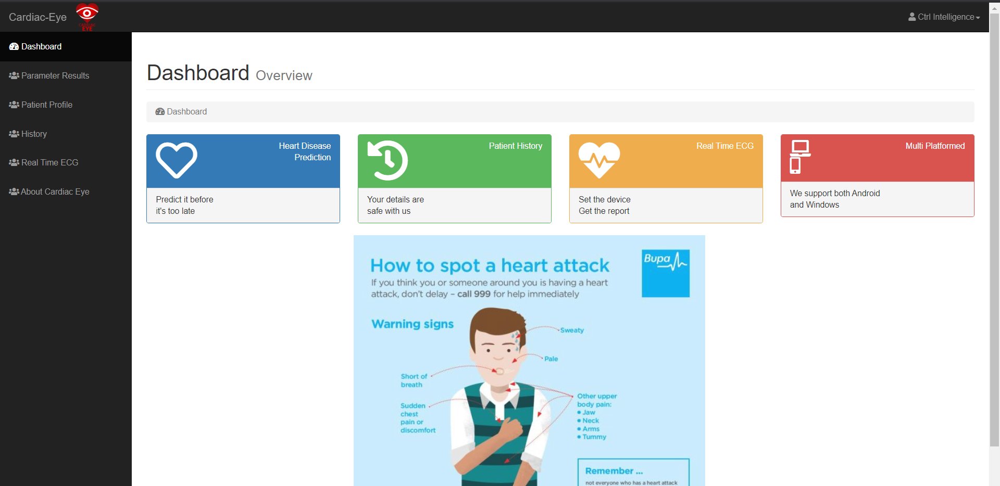
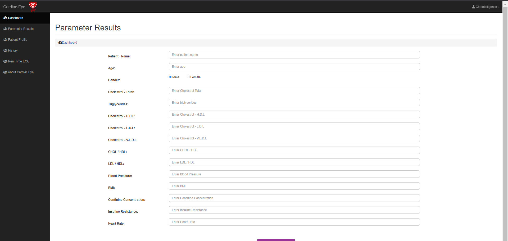

# Cardiac-Eye

### University of Westminster Software Engineering degree programme 2nd year Group Project

A data science project which focuses on finding if any patient have a risk of getting a heart disease accorrding to the the user's medical data inputted to the system.
- Predict for heart diseases (85% Accuracy)
- Track real-time ECG of the patient (IoT device to track ECG and real-time ECG variation is shown from the application)
- View history of the patient's medical records
- Easy to track medical records

- Classification using Naive Bayes 

